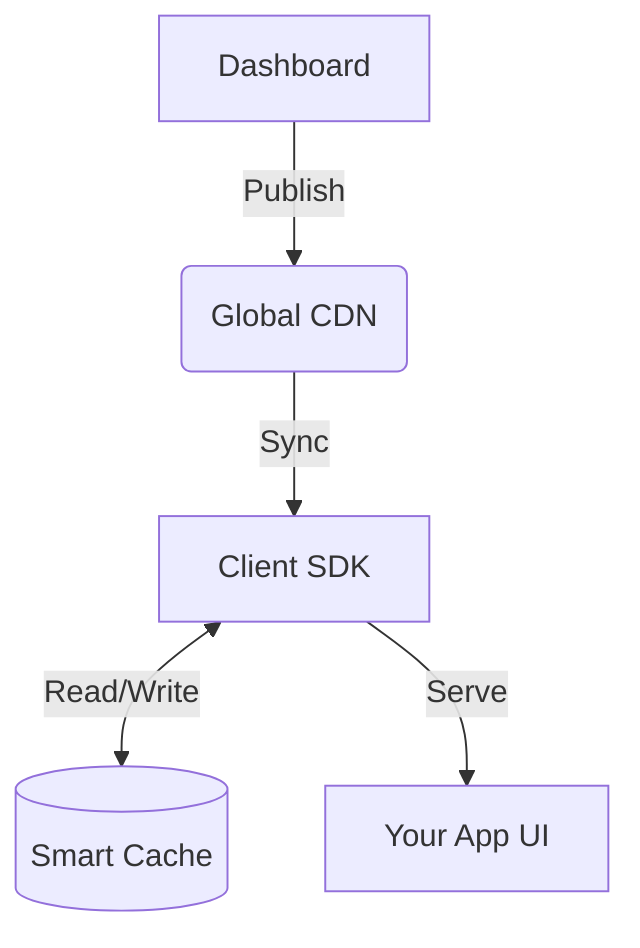

---

Stringboot is built on a robust architecture designed for performance, reliability, and developer experience. Understanding these core concepts will help you get the most out of the platform.

## Architecture

At its heart, Stringboot is a **synchronized state management system** for your application's text content.

<Steps>
  <Step title="Dashboard">
    The command center where you manage strings, languages, and experiments. Changes published here are instantly propagated.
  </Step>
  <Step title="Global CDN">
    A low-latency edge network that distributes your content worldwide, ensuring fast sync times for users everywhere.
  </Step>
  <Step title="Client SDK">
    The intelligent engine running in your app. It handles synchronization, caching, and offline logic transparently.
  </Step>
  <Step title="Smart Cache">
    A multi-layered caching system (Memory + Disk) that guarantees instant string retrieval and offline availability.
  </Step>
</Steps>

## Offline-First Design

Stringboot is designed to be **offline-first**, ensuring resilience and performance.

<CardGroup cols={3}>
  <Card title="No Blocking Calls" icon="bolt">
    String retrieval is always synchronous (from cache) or non-blocking async.
  </Card>
  <Card title="Resilience" icon="shield-check">
    Your app works perfectly even if the Stringboot API is down or the user has no internet.
  </Card>
  <Card title="Background Sync" icon="arrows-rotate">
    The SDK handles network operations in the background, updating the cache silently.
  </Card>
</CardGroup>

## The Caching Strategy

We use a sophisticated **3-Tier Caching Strategy**:

<CardGroup cols={1}>
  <Card title="L1: Memory Cache (RAM)" icon="memory">
    **Speed:** Instant (< 0.1ms) | **Purpose:** Serves the most frequently used strings (e.g., UI labels).
  </Card>
  <Card title="L2: Persistent Cache (Disk/DB)" icon="database">
    **Speed:** Fast (< 10ms) | **Purpose:** Stores the entire string catalog for offline access.
  </Card>
  <Card title="L3: Network (CDN)" icon="globe">
    **Speed:** Variable (50ms - 500ms) | **Purpose:** Source of truth for updates.
  </Card>
</CardGroup>

## String-Sync Protocol

Stringboot uses a custom **Delta Sync Protocol** to minimize data usage:

<Steps>
  <Step title="Meta Check">
    The SDK first checks a lightweight "Meta" endpoint to see if anything changed (using ETags).
  </Step>
  <Step title="Delta Download">
    If changes are detected, it downloads *only* the strings that have changed since the last sync.
  </Step>
  <Step title="Atomic Update">
    The local cache is updated atomically to ensure consistency.
  </Step>
</Steps>

## A/B Testing Engine

Stringboot includes a native A/B testing engine.

<CardGroup cols={2}>
  <Card title="Assignment" icon="users">
    Users are assigned to experiment variants deterministically based on their Device ID.
  </Card>
  <Card title="Sticky" icon="magnet">
    Once assigned, a user sees the same variant until the experiment ends.
  </Card>
  <Card title="Analytics" icon="chart-line">
    The SDK emits events that you can send to your analytics provider (e.g., Firebase, Mixpanel).
  </Card>
</CardGroup>

## Security

<CardGroup cols={3}>
  <Card title="Read-Only Tokens" icon="key">
    Client SDKs use read-only API tokens. They cannot modify data on the server.
  </Card>
  <Card title="HTTPS" icon="lock">
    All communication is encrypted over HTTPS.
  </Card>
  <Card title="Integrity" icon="file-signature">
    Responses are signed to prevent tampering.
  </Card>
</CardGroup>